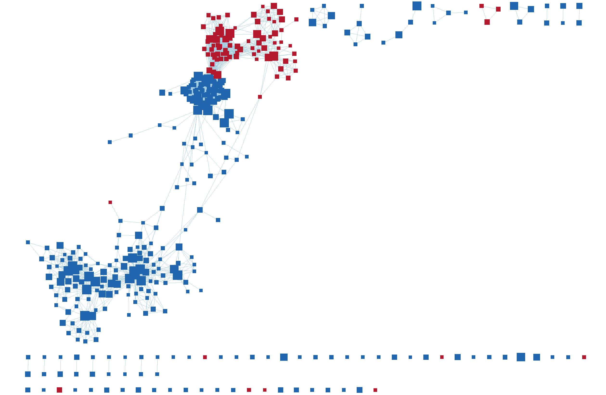
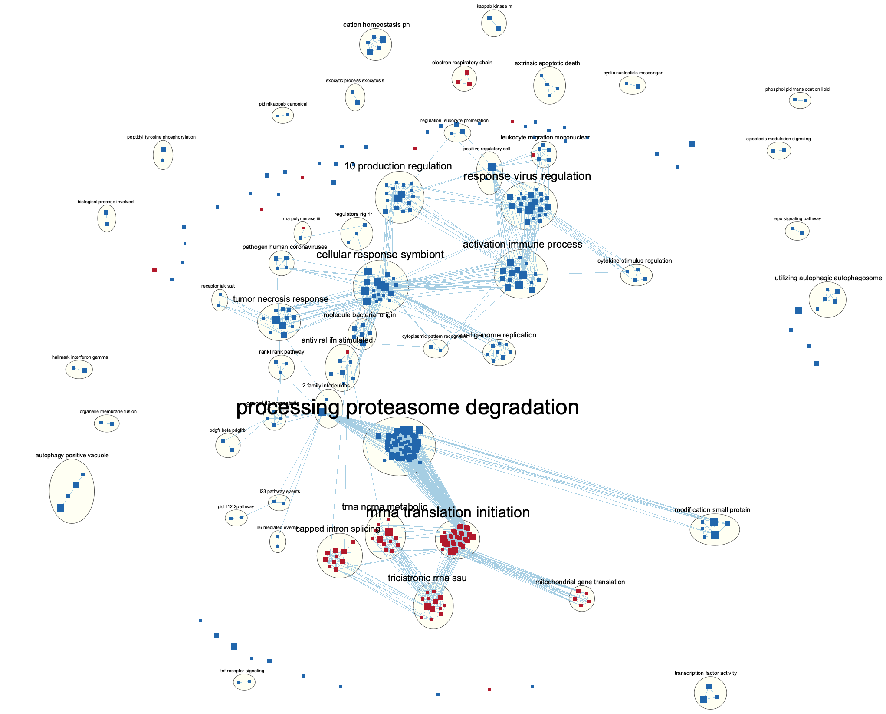
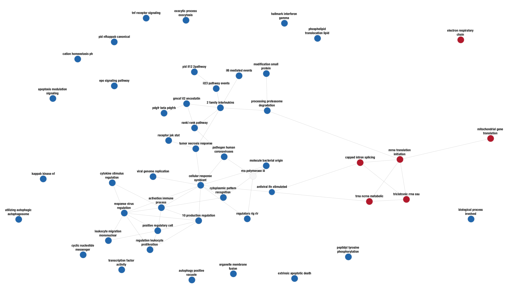
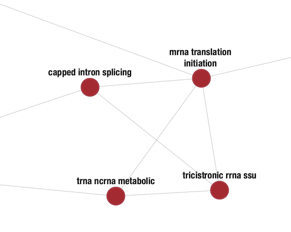
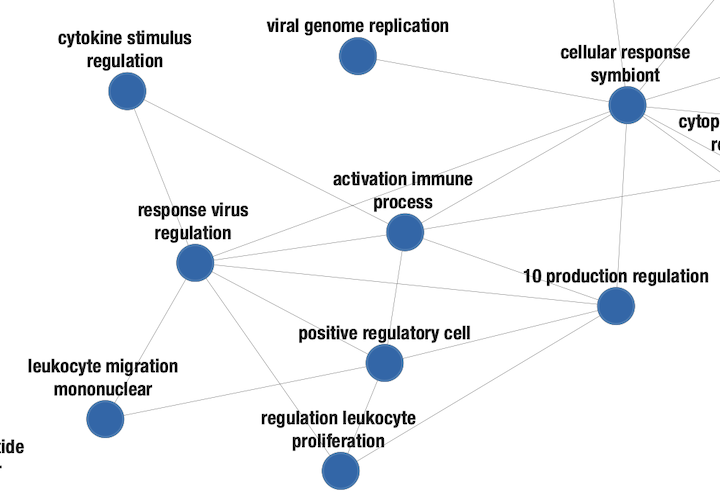
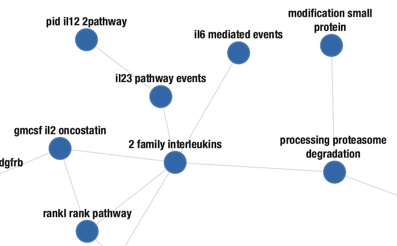
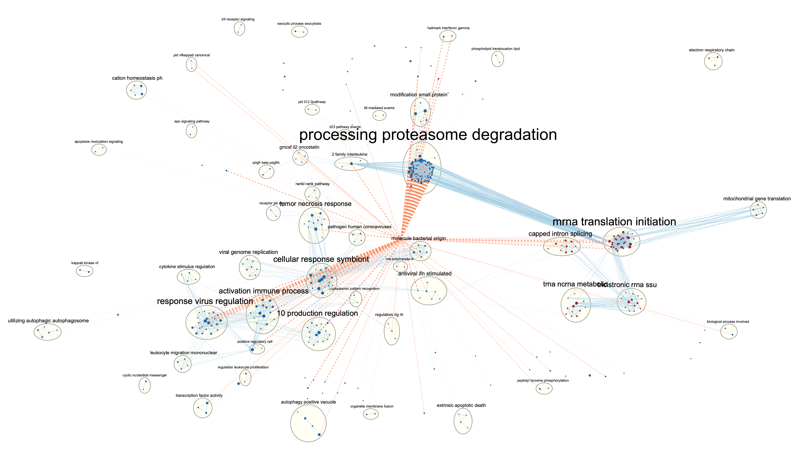

## Introduction

This report is a continuation of Assignment 1: Dataset Selection and Initial Processing and Assignment 2: Differential Gene Expression and Preliminary ORA. 

In Assignment 1, GEO dataset GSE166605: RNA-sequencing analysis of effect of miR-155 overexpression in human CD14+ monocytes (Olsson et al. 2021) was selected as the dataset of interest. MicroRNAs (miRs) are essential regulators for pro-inflammatory effector functions of myeloid cells and miR dysfunction is implicated in rheumatoid arthritis (RA).The study investigates two groups, miR-155 and negative control, in 5 donors to understand the effect of miR-155 overexpression in human CD14+ monocytes and the general role of miR-155 in innate and adaptive immunity.

The raw count data contains a total of 60603 genes. Genes that have low counts were removed from the raw count data and normalization was subsequently performed using the `edgeR` package (Robinson et al., 2010). The multidimensional scaling (MDS) plot of the post-normalization data showed a clear separation of the samples in the two groups, suggesting that miR-155 groups and negaitve control groups have different behaviours across their counts and differential expressions. The Ensembl gene IDs in the original count data were mapped to HGNC symbols to create the final normalized dataset. The final coverage of the miR-155 dataset is 13003 genes along with their Ensembl gene IDs, HGNC symbols, and normalized counts in 5 donors (10 samples).

In Assignment 2, genes from the normalized expression data were ranked based on their differential expression. A thresholded over-representation analysis (ORA) was subsequently performed to highlight dominant themes in the gene list. I found that the up-regulated genes are linked to the ribosome-mediated cytoplasmic translation of proteins, while the down-regulated genes are mostly involved in the pattern recognition receptor signaling pathway that protects the body against viral infections. 

In this assignment, I will perform non-thresholded gene set enrichment analysis (GSEA) using the ranked set of genes from Assignment 2. Next, I will use the Cytoscape EnrichmentMap app (Merico et al., 2010) to visualize the GSEA results and compare them to the results from the thresholded anlaysis. Finally, a post analysis is performed to further investigate the relationship between my model and adaptive immunity.


## Import Ranked Gene List

```{r setup, include=FALSE}
knitr::opts_chunk$set(warning = FALSE, message = FALSE)

# Install required packages
if (!require("BiocManager", quietly = TRUE)) {
  install.packages("BiocManager")
}
if (!requireNamespace("GEOquery", quietly = TRUE)) {
  BiocManager::install("GEOquery")
}
if (!requireNamespace("edgeR", quietly = TRUE)) {
  BiocManager::install("edgeR")
}
if (!requireNamespace("limma", quietly = TRUE)) {
  BiocManager::install("limma")
}
if (!requireNamespace("Biobase", quietly = TRUE)) {
  BiocManager::install("Biobase")
}
if (!requireNamespace("fgsea", quietly = TRUE)) {
  BiocManager::install("fgsea")
}
if (!requireNamespace("cmapR", quietly = TRUE)) {
  BiocManager::install("cmapR")
}
if (!require("RCurl", quietly = TRUE)) {
  install.packages("RCurl")
}
if (!require("tibble", quietly = TRUE)) {
  install.packages("tibble")
}
if (!require("kableExtra", quietly = TRUE)) {
  install.packages("kableExtra")
}
```

First, I obtained the ranked list of genes in miR155+ vs. control conditions.

```{r rankedList, echo=FALSE}
# A way to download the dataset only when necessary instead of re-downloading it every time the Notebook is run
gseDirectory <- file.path(getwd(), "GSE166605")
if (!file.exists(gseDirectory)) {
  # Get the supplementary files from GEO
  suppFiles <- GEOquery::getGEOSuppFiles("GSE166605")
  # There is only one supplementary file
  fnames <- rownames(suppFiles)
} else {
  fnames <- file.path(gseDirectory, "GSE166605_D1-5_Neg_C_miR_155_RAW_counts.txt.gz")
}
# Read in the original count data
expData <- read.delim(fnames[1], header = TRUE, check.names = FALSE)

# Read in the normalized count data
normalizedCountsData <- read.table(file = file.path(getwd(), "GSE166605_normalized_counts.txt"),
                                   header = TRUE, sep = "\t",
                                   stringsAsFactors = FALSE,
                                   check.names = FALSE)

# Translate raw counts into counts per million (CPM)
cpms <- edgeR::cpm(expData[, 3:12])
rownames(cpms) <- expData[, 1]

# Keep the genes with high enough counts
keep <- rowSums(cpms > 1) >= 5
expDataFiltered <- expData[keep, ] # 13003 observations
filteredDataMatrix <- as.matrix(expDataFiltered[, 3:12])
rownames(filteredDataMatrix) <- expDataFiltered$GeneID

# Define the cell types
# Extract the donor and cell types from the original data
samples <- data.frame(lapply(colnames(expData)[3:12], 
                             FUN = function(x) {unlist(strsplit(x, split = " "))[c(1, 3)]}))
colnames(samples) <- colnames(expData)[3:12]
rownames(samples) <- c("donors", "cell_type")
samples <- data.frame(t(samples))
# Subset the normalized data to get expression values only
expressionMatrix <- as.matrix(normalizedCountsData[, c(3:ncol(normalizedCountsData))])

# Create a linear model with data defined by cell type only
simpleModelDesign <- model.matrix(~ samples$cell_type)

# Use the heatmapMatrix from earlier to create the data matrix
minimalSet <- Biobase::ExpressionSet(assayData = as.matrix(expressionMatrix))

# Fit the data
fit <- limma::lmFit(minimalSet, simpleModelDesign)

# Use empirical Bayes to compute differential expression
# Use trend = TRUE for RNA-seq data
fit2 <- limma::eBayes(fit, trend = TRUE)

# Find the top fit
# Use Benjamini-Hochberg for multiple hypothesis correction
topfit <- limma::topTable(fit2,
                          coef = ncol(simpleModelDesign),
                          adjust.method = "BH", 
                          number = nrow(expressionMatrix))

# Merge the top fit data with HGNC symbols
simpleModelOutput <- merge(normalizedCountsData[, c(1:2)],
                           topfit,
                           by.x = 1,
                           by.y = 0,
                           all.y = TRUE)

# Calculate the rank
simpleModelOutput[, "rank"] <- -log(simpleModelOutput$P.Value, base = 10) * sign(simpleModelOutput$logFC)
simpleModelOutput <- simpleModelOutput[order(-simpleModelOutput$rank), ]

gene_list <- simpleModelOutput[, c("hgnc_symbol", "rank")]

head(gene_list) %>% kbl(caption = "Table 1: Ranked Gene List in miR155+ vs. Control Conditions", col.names = c("HGNC Symbol", "Rank")) %>% kable_styling(bootstrap_options = c("striped", "hover"))
```

## Non-thresholded Gene Set Enrichment Analysis (GSEA)

1. The GSEA analysis was conducted using the GSEA software developed as a joint project of UC San Diego and Broad Institute (Subramanian et al., 2005 & Mootha et al., 2003). I used the Gene Ontology Biological Process (GO:BP) as my genet sets (Ashburner et al., 2000). These gene sets were downloaded from Bader Lab using the newest version up to date, i.e., the April_01_2022 version (Merico et al., 2010). For GO:BP, the no_GO_iea (inferred from electronic annotation) version was used to ensure the accuracy of the gene sets and results. 

```{r GSEA, include=FALSE}
gmtDir <- "./gmt_files/"

# Obtain pathways list from BaderLab
goUrl = "http://download.baderlab.org/EM_Genesets/current_release/Human/symbol/Human_GOBP_AllPathways_no_GO_iea_April_01_2022_symbol.gmt"
goDest <- paste(gmtDir, "GOBP.gmt", sep = "")
download.file(goUrl, destfile = goDest)

# Read in the pathways
goPathways <- fgsea::gmtPathways(paste(gmtDir, "GOBP.gmt", sep = ""))
```

2. Table 1 and 2 present the top 3 gene sets that are overrepresented at the top or bottom of the ranked list, respectively. The top of the ranked list are more correlated with the miR155 present condition, while the bottom are more correlated with the normal control condition. From Table 1 and 2, we see the gene sets that are overrepresented at the top of the ranked list are: eukaryotic translation initiation, L13A-mediated translational silencing of ceruloplasmin expression, and Cap-dependent translation initiation, where the last two events are both participants of eukaryotic translation initiation. For the bottom of the ranked list, gene sets that are overrepresented are: interferon gamma response, interferon alpha response, and interferon gamma signaling, which are all processes involved in interferon signaling. Therefore, the gene sets overrepresented for the genes that are more correlated with the miR155+ condition are related to eukaryotic translation initiation, while those for the genes that are more correlated with the control group are associated with interferon signaling. 

```{r comparisons, echo=FALSE}
posResults <- data.frame(name = c("Eukaryotic Translation Initiation", "L13A-Mediated Translational Silencing of Ceruloplasmin Expression", "Cap-Dependent Translation Initiation"),
                         size = c(114, 106, 114),
                         ES = c(0.8060102, 0.81139886, 0.8060102),
                         NES = c(3.2325532, 3.2207181, 3.207574),
                         normalized_pval = c(0.0, 0.0, 0.0),
                         FDR_qval = c(0.0, 0.0, 0.0))

negResults <- data.frame(name = c("Hallmark Interferon Alpha Response", "Hallmark Interferon Gamma Response", "Interferon Gamma Singaling"),
                         size = c(80, 154, 72),
                         ES = c(-0.90056247, -0.8277539, -0.7809945),
                         NES = c(-3.3253083, -3.2907667, -2.821025),
                         normalized_pval = c(0.0, 0.0, 0.0),
                         FDR_qval = c(0.0, 0.0, 0.0))

upRegulated <- data.frame(term_id = c("GO:0002181", "KEGG:03010", "REAC:R-HSA-8868773", "WP:WP477"),
                          source = c("GO:BP", "KEGG", "Reactome", "WikiPathways"),
                          term_name = c("cytoplasmic translation", "ribosome", "rRNA processing in the nucleus and cytosol", "cytoplasmic ribosomal proteins"))

downRegulated <- data.frame(term_id = c("GO:0002221", "KEGG:05169", "REAC:R-HSA-913531", "WP:WP183"),
                            source = c("GO:BP", "KEGG", "Reactome", "WikiPathways"),
                            term_name = c("pattern recognition receptor signaling pathway", "Epstein-Barr virus infection", "interferon signaling", "proteasome degradation"))

# Display the tables
posResults %>% kbl(caption = "Table 2A: Top Gene Sets Overrepresented at the Top of the Ranked Gene List", col.names = c("Name", "Size", "ES", "NES", "Normalized p-value", "FDR q-value")) %>% kable_styling(bootstrap_options = c("striped", "hover"))

negResults %>% kbl(caption = "Table 2B: Top Gene Sets Overrepresented at the Bottom of the Ranked Gene List", col.names = c("Name", "Size", "ES", "NES", "Normalized p-value", "FDR q-value")) %>% kable_styling(bootstrap_options = c("striped", "hover"))

upRegulated %>% kbl(caption = "Table 3A: Top Gene Set Terms for Genes Up-regulated in miR155+ Cells", col.names = c("Term ID", "Source", "Term Name")) %>% kable_styling(bootstrap_options = c("striped", "hover"))

downRegulated %>% kbl(caption = "Table 3B: Top Gene Set Terms for Genes Down-regulated in miR155+ Cells", col.names = c("Term ID", "Source", "Term Name")) %>% kable_styling(bootstrap_options = c("striped", "hover"))
```

3. Table 3 and 4 show terms that are overrepresented for up-regulated and down-regulated genes in the miR155 present condition, respectively, from the thresholded overrepresentation analysis in Assignment 2. The terms that are overrepresented for the up-regulated genes are involved in ribosome-mediated cytoplasmic translation of proteins, which is consistent with the non-thresholded results at the top of the ranked list - Cap-dependent translation initiation. Cap-dependent translation initiation is a cytosolic process that involves ribosomes, which contain rRNAs. The terms that are overrepresented for the down-regulated genes are involved in immune responses. Induction of interferon gene expression is one of the immune responses upon viral infection, and we observe that the term interferon signaling is overrepresented in both the thresholded and non-thresholded analyses, showing consistent results across different methods.

## Visualization with Cytoscape & Enrichment Map

1. The enrichment map was created using the EnrichmentMap app in Cytoscape (Merico et al., 2010). The FDR q-value cutoff and p-value were set to 0.05 and 0.001, respectively. These thresholds were chosen because they are considered conservative in the EnrichmentMap User Guide and I want to ensure the most relatively stringent results. The resulting enrichment map has 431 nodes and 5867 edges. To make the network easier to visualize, I changed the font face to HelveticaNeue-CondensedBold and font size to 6. 



2. The annotation was done using the AutoAnnotate app (Kucera et al., 2016) in Cytoscape. The maximum number of annotations was set to 50 to avoid over-annotation where singletons are annotated as their own themes. The clusterMaker App with MCL Cluster algorithm was selected. 

3. Publication-ready figure:


4. The collapsed network was created using the Create Summary Network (Clusters Only) tool. 


There are several major themes present in this analysis. 

Theme 1: Macromolecule Metabolic Process
Gene sets that are found at the top of the ranked gene list (shown in red) form a major theme: macromolecule metabolic process, which consists of capped intron splicing, mRNA translation initiation, and tRNA ncRNA metabolic. Capped intron splicing and tRNA ncRNA metabolic are both RNA metabolic processes, while mRNA translation initiation is under the category gene expression; both RNA metabolic process and gene expression are both under macromolecule metabolic process based on gene ontology. 


Theme 2: Regulation
Another theme is found where positive regulatory cell is at the centre. The processes it connects to, including cytokine stimulus regulation, response virus regulation, regulation leukocyte proliferation, and 10 production regulation, are all associated with regulatory events. 


Theme 3: Immune Response
The interleukin(IL)-2 family of cytokines play a major role in maintaining T lymphocyte populations (Benczik & Gaffen, 2004). IL23 and IL6 regulate the immune and inflammatory response and affects organ development (Duvallet et al., 2011 & Su et al., 2017). IL2 and GMCSF (granulocyte-macrophage colony-stimulating factor) are effective to induce tumor-specific systemic immune responses (Wen et al., 2016). The ubiquitin-proteasome degradation pathway also plays an important role in immune and inflammatory response (Reinstein, 2004).


## Interpretation and Detailed View of Results
1. Do the enrichment results support conclusions or mechanism discussed in the original paper? How do these results differ from the results you got from Assignment #2 thresholded methods?

One conclusion discovered in the original paper suggested that monocytes with high expression of miR-155 can modulate the adaptive immune response by stimulating polyfunctional CD4+ T cells (Olsson et al. 2021). The enrichment results suggest that gene sets overrepresented in genes that are more correlated with miR155+ condition are involved in translation initiation and that gene sets overrepresented in genes that are more correlated with the control condition are involved in the immune response. The results might suggest that miR155 plays a major role in the translation initiation process involved in the immune response process. These results correlate with the thresholded results, where up-regulated genes are involved in ribosome-mediated cytoplasmic translation of proteins and the down-regulated genes are involved in immune responses. 

2. Can you find evidence, i.e. publications, to support some of the results that you see. How does this evidence support your result?

Previous research has shown that miR155 regulates the maturation of dendritic cells (DC), which active antigen-specific T-cells and are key innate regulators of the adaptive immune response. miRNA networks act at checkpoints during the development, differentiation, and action of DCs and miR155 plays an important role in DC activation. miR155 also acts as a regulator for switching from the endocytic function to co-stimulatory function during DC maturation (Alivernini et al., 2017). 

## Post Analysis
The post analysis was conducted using EnrichmentMap. Since miR155 is involved in the adaptive immune response, I selected the Reactome adaptive immune system gene set (Griss et al., 2020). The results are shown in Figure 7. The signature gene set is associated with the majority of the existing gene sets - both the immune response and macromolecule metabolic process - indicating that the GSEA provides correct analysis and emphasizes miR155's role in the adaptive immune response.



## References
Olsson, A. M., Povoleri, G., Somma, D., Ridley, M. L., Rizou, T., Lalnunhlimi, S., Macdonald, L., Rajasekhar, M., Martinez-Nunez, R. T., Kurowska-Stolarska, M., & Taams, L. S. (2021). miR-155 overexpressing monocytes resemble HLA highISG15 + synovial tissue macrophages from patients with rheumatoid arthritis and induce polyfunctional CD4+ T cell activation. Clinical and experimental immunology, uxab016. Advance online publication. https://doi.org/10.1093/cei/uxab016

Robinson MD, McCarthy DJ and Smyth GK (2010). edgeR: a Bioconductor package for differential expression analysis of digital gene expression data. Bioinformatics 26, 139-140

Merico, D., Isserlin, R., Stueker, O., Emili, A., & Bader, G. D. (2010). Enrichment map: a network-based method for gene-set enrichment visualization and interpretation. PloS one, 5(11), e13984. https://doi.org/10.1371/journal.pone.0013984

Subramanian, A., Tamayo, P., Mootha, V. K., Mukherjee, S., Ebert, B. L., Gillette, M. A., Paulovich, A., Pomeroy, S. L., Golub, T. R., Lander, E. S., & Mesirov, J. P. (2005). Gene set enrichment analysis: a knowledge-based approach for interpreting genome-wide expression profiles. Proceedings of the National Academy of Sciences of the United States of America, 102(43), 15545–15550. https://doi.org/10.1073/pnas.0506580102

Mootha, V. K., Lindgren, C. M., Eriksson, K. F., Subramanian, A., Sihag, S., Lehar, J., Puigserver, P., Carlsson, E., Ridderstråle, M., Laurila, E., Houstis, N., Daly, M. J., Patterson, N., Mesirov, J. P., Golub, T. R., Tamayo, P., Spiegelman, B., Lander, E. S., Hirschhorn, J. N., Altshuler, D., … Groop, L. C. (2003). PGC-1alpha-responsive genes involved in oxidative phosphorylation are coordinately downregulated in human diabetes. Nature genetics, 34(3), 267–273. https://doi.org/10.1038/ng1180

Ashburner, M., Ball, C. A., Blake, J. A., Botstein, D., Butler, H., Cherry, J. M., Davis, A. P., Dolinski, K., Dwight, S. S., Eppig, J. T., Harris, M. A., Hill, D. P., Issel-Tarver, L., Kasarskis, A., Lewis, S., Matese, J. C., Richardson, J. E., Ringwald, M., Rubin, G. M., & Sherlock, G. (2000). Gene ontology: tool for the unification of biology. The Gene Ontology Consortium. Nature genetics, 25(1), 25–29. https://doi.org/10.1038/75556

Gene Ontology Consortium (2021). The Gene Ontology resource: enriching a GOld mine. Nucleic acids research, 49(D1), D325–D334. https://doi.org/10.1093/nar/gkaa1113

Kucera, M., Isserlin, R., Arkhangorodsky, A., & Bader, G. D. (2016). AutoAnnotate: A Cytoscape app for summarizing networks with semantic annotations. F1000Research, 5, 1717. https://doi.org/10.12688/f1000research.9090.1

Benczik, M., & Gaffen, S. L. (2004). The interleukin (IL)-2 family cytokines: survival and proliferation signaling pathways in T lymphocytes. Immunological investigations, 33(2), 109–142. https://doi.org/10.1081/imm-120030732

Duvallet, E., Semerano, L., Assier, E., Falgarone, G., & Boissier, M. C. (2011). Interleukin-23: a key cytokine in inflammatory diseases. Annals of medicine, 43(7), 503–511. https://doi.org/10.3109/07853890.2011.577093

Su, H., Lei, C. T., & Zhang, C. (2017). Interleukin-6 Signaling Pathway and Its Role in Kidney Disease: An Update. Frontiers in immunology, 8, 405. https://doi.org/10.3389/fimmu.2017.00405

Wen, Q., Xiong, W., He, J., Zhang, S., Du, X., Liu, S., Wang, J., Zhou, M., & Ma, L. (2016). Fusion cytokine IL-2-GMCSF enhances anticancer immune responses through promoting cell-cell interactions. Journal of translational medicine, 14, 41. https://doi.org/10.1186/s12967-016-0799-7

Reinstein E. (2004). Immunologic aspects of protein degradation by the ubiquitin-proteasome system. The Israel Medical Association journal : IMAJ, 6(7), 420–424.

Alivernini, S., Gremese, E., McSharry, C., Tolusso, B., Ferraccioli, G., McInnes, I. B., & Kurowska-Stolarska, M. (2018). MicroRNA-155-at the Critical Interface of Innate and Adaptive Immunity in Arthritis. Frontiers in immunology, 8, 1932. https://doi.org/10.3389/fimmu.2017.01932

Griss J, Viteri G, Sidiropoulos K, Nguyen V, Fabregat A, Hermjakob H. ReactomeGSA - Efficient Multi-Omics Comparative Pathway Analysis. Mol Cell Proteomics. 2020 Sep 9. doi: 10.1074/mcp. PubMed PMID: 32907876.